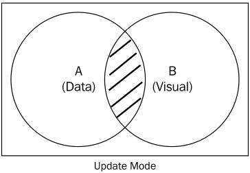
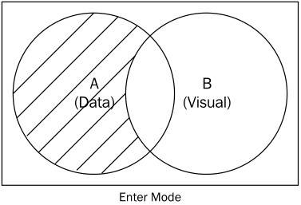
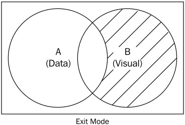

# D3系列

## 基本介绍

> D3(Data-Driven Documents)是一个数据可视化库，作者是 [Mike Bostock](https://bost.ocks.org/mike/)

## 特点

- 数据绑定（DOM）
> 将数据绑定DOM上（**\_\_data\_\_**属性上），方便二者相互转换操作，比如：根据当前的DOM获取原始数据，经计算转换后用于绘制其它图形，反过来，也可以根据数据过滤DOM

- 转换数据与图形分离
> 一般的可视化图（ECharts.js，Highchatrs.js等）API，是输入数据直接绘制图形的，但D3是将输入数据进行计算转换成图形所需要的数据，开发者自己绘制图形  
> D3这种方式看似比较麻烦，但对于复杂的图形有更定制化需求时，会提高很大的自由度

- 提供大量的布局和可视化效果案例

## 更新Update、插入Enter、退出Exit模式

```js
var doms = root.selectAll("div").data([1,2,3]);
doms.text((d) => d);
doms.enter().append("div").text((d) => d);
doms.exit().remove();
```
> 数据绑定方法：data方法是绑定元素集合，datum方法是绑定单个元素

  

更新Update模式 **A∩B**  
  

进入Enter模式 **A\B**  
  

退出Exit模式 **B\A**  


## 一些术语

### 选择器 selection
###比例尺 scale

- d3.scaleLinear 线性比例尺
> 说明：线性比例尺使用插值器来计算，domain元素必须为数值类型或是字符型数字  
> 默认插值器包括：字符串插值、颜色插值、数组插值、对象插值、数字插值，根据range元素类型自动执行相应的插值器  
> domain数组长度>=2，range数组长度>=2，其中当domain.length>2时，元素要从小到大排序，否则无法按domain范围到range范围输出

默认：  
domain:[0,1]  
range:[0,1]  
输出：x(==x)，输入数字，即输出为相应的数值，不能转换为数字时，输出为NaN  

例如： 

```js
var scale = d3.scaleLinear().domain([0,100,200]).range([10,20,30]); scale(150)//输出25
var scale = d3.scaleLinear().domain([0,200,100]).range([10,20,30]); scale(150)//输出17.5
```

插值器计算方法（domain和range长度为2时，0=<t<=1）：  
> domain和range元素都是数字时，输出：a * (1 - t) + b * t，其中t＝(x-domain[0])/(domain[1]-domain[0]),a=range[0],b=range[1],domain[0]>domain[1]时，domain和range执行reverse()  
> range元素为字符串时，针对数字部分进行上述计算（没有数字部分输出为range[1]内容），保留字符串(不参与插值)，例如：var scale=d3.scaleLinear().domain([0,100]).range(["10px","20px"]);scale(50)//输出15px  
> range元素为颜色值（rgb,hsl,hcl,lab）时，分别按相应的颜色模式进行插值  
> range元素为数组且数组元素包含数字时，输出时，保留数组形式并插值计算数组内元素，当range元素各数组长度不一致时，只插值计算相同下标内元素，例如：var scale=d3.scaleLinear().domain([0,100]).range([[10],[20]]);scale(50)//输出[15];  
> var scale=d3.scaleLinear().domain([0,100]).range([[10,30],[20]]);scale(15)//输出[15, 30];  
> range元素为对象时，插值计算对象内元素，例如：var scale=d3.scaleLinear().domain([0,100]).range([{"width":10},{"width":20}]);scale(50)//输出{width: 15}  
> 应用场景：趋势统计类  


d3.scalePow 指数比例尺  
> 基于d3.scaleLinear，默认指数为1，将domain各元素和输入值进行指数操作后进行线性插值，例如：var scale=d3.scale.pow().domain([0,100]).range([10,20]).exponent(2);scale(50) //输出12.5   
应用场景：圆面积变化  

d3.scaleSqrt 平方根比例尺  
> 参见d3.scalePow.exponent(0.5)  
> 应用场景：根据圆面积反应数据变化

d3.scaleLog 对数比例尺  
> 基于d3.scaleLinear，将domain各元素和输入值进行对数操作后进行线性插值，注意domain各元素>0，否则输出NaN  
> 应用场景：  

d3.scaleQuantize 量化比例尺  
> 说明：domain各元素必须为数值类型，domain数组长度>=2,range数组长度>=2，其中domain在计算中只使用了domain[0]和domain[domain.length-1]2个值  
	默认:  
	domain:[0,1]  
	range:[0,1]  
	输出:  
	range[index]  
	index有效值为0～range.length-1  
	index=Math.floor((输入值-domain[0]) * range.length/(domain[domain.length-1]-domain[0]))   
> 应用场景：  

d3.scaleThreshold 阈值比例尺  
> 默认:  
	domain:[0.5]  
	range[0,1]  
	输出：0(==0)，1（>=1）  
	domain各元素必须为数值类型，对domain正排序后，查找输入值在domain中的插入的位置（右侧）index，输出为range[index],通常range元素数量要比domain多一个  
> 应用场景：  

d3.scaleQuantile 分位比例尺  
> 默认为空  
  domain各元素必须为数值类型，非数值类型将过滤，使用d3.quantile将domain生成新的分位值数组(range长度)，使用bisect在分位值数组中找到输入值所在的插入点位置index  
  输出: range[index]  
> 应用场景：  

d3.scaleIdentity 等价比例尺  
> 默认:  
  domain:[0,1]  
  range:[0,1]  
  输出：  
  x(==x)，输入数字，即输出为相应的数值，不能转换为数字时，输出为NaN  
  只需要设置domain，range同domain的值一致，作用是将domain元素中字符型数字转换为数值类型，以便输出使用  
> 应用场景：  

d3.scaleOrdinal 序数比例尺  
> 默认：  
	domain:[]  
	range:[0,1]  
	输出为空  
	生成domain中元素关联到range相应的元素的map对象，输出为map对象输入值对应的键值，当输入值不在map对象中，将当前输入值添加到domain中，并domain长度与range长度取模，用取模是为了在range数量中取值（每次执行新的scale都会添加到domain中）  
	输出: range[取模值]  
> 应用场景：分类   

d3.scaleTime 时间比例尺  
> 基于d3.scaleLinear，只是将domain格式化为日期类型（输入值也必须为日期类型，数值类型时输出range[0]，其它类型时输出NaN），当domain元素不是日期类型的值时，输入日期输出为当前时间戳，输入数字类型时，按线性比例输出。  
> 应用场景：时间轴  

- 4.x增加  

d3.scalePoint  
> 默认：range:[0,1], paddingInner = 1  
	基于d3.scaleOrdinal，根据range划分出domain.length份的values，步长 = (range[1] - range[0]) / (domain().length - 1)  
	输出：domain[i] -> values[i]  
> 应用场景：分类，但range元素数量只能是2个  

d3.scaleBand  
> 默认：range:[0,1], paddingInner = 0, paddingOuter = 0  
	基于d3.scaleOrdinal，根据range划分出domain.length份的values，步长 = (range[1] - range[0]) / (domain().length - paddingInner + paddingOuter * 2)  
	输出：domain[i] -> values[i]  
> 应用场景：分类，但range元素数量只能是2个  

d3.scaleImplicit  
> 在d3.scaleOrdinal中用于unknown值的判断，当为unknown != d3.scaleImplicit时，直接返回unknown值  
> 应用场景：在使用d3.scaleOrdinal中，直接将特殊值当作返回值使用  

d3.scaleSequential  
> 基于d3.scaleLinear，必须先指定interpolator，并且domain必须是2个数值类型元素，简单地将 (x - domain[0]) / (domain[1] - domain[0])结果用于插值器中  
> 应用场景：特定插值计算的数值数据

### 插值器 interpolation
```js
	var a=d3.scaleLinear().domain([0,100]).range([0,10]);
	a.interpolate(function(){return function(t){return 0*(1-t)+1000*t;}});//自定义插值器，0为值域开始，1000为值域终止
	a(10);//根据自定义插值方式显示：100
```

### 布局 layout