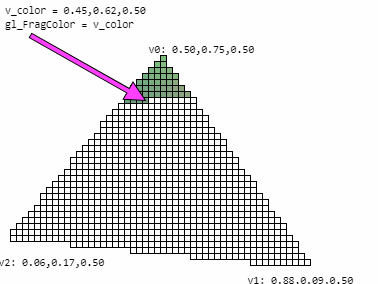

# GLSL 着色器

> GLSL全称是 Graphics Library Shader Language （图形库着色器语言），是着色器使用的语言。

## 顶点着色器
 
 > [WebGL工作原理](https://webglfundamentals.org/webgl/lessons/zh_cn/webgl-how-it-works.html)


## 片元着色器



## 变量命名约定

- 前缀a_ 代表属性，值从缓冲中提供；
- 前缀u_ 代表全局变量，直接对着色器设置
- 前缀v_ 代表可变量，是从顶点着色器的顶点中插值来出来的

## 顶点着色器内置变量
| 名称 										| 类型 	| 描述 |
|:------------------------|:------|:-----|
| gl_Color								| vec4  | 输入属性-表示顶点的主颜色|
| gl_SecondaryColor 			| vec4  | 输入属性-表示顶点的辅助颜色|
| gl_Normal 							| vec3  | 输入属性-表示顶点的法线值|
| gl_Vertex 							| vec4  | 输入属性-表示物体空间的顶点位置|
| gl_MultiTexCoordn 			| vec4  | 输入属性-表示顶点的第n个纹理的坐标|
| gl_FogCoord 						| float | 输入属性-表示顶点的雾坐标|
| gl_Position 						| vec4  | 输出属性-变换后的顶点的位置，用于后面的固定的裁剪等操作。所有的顶点着色器都必须写这个值。|
| gl_ClipVertex 					| vec4  | 输出坐标，用于用户裁剪平面的裁剪|
| gl_PointSize 						| float | 点的大小|
| gl_FrontColor 					| vec4  | 正面的主颜色的varying输出|
| gl_BackColor 						| vec4  | 背面主颜色的varying输出|
| gl_FrontSecondaryColor  | vec4  | 正面的辅助颜色的varying输出|
| gl_BackSecondaryColor 	| vec4  | 背面的辅助颜色的varying输出|
| gl_TexCoord[] 					| vec4  | 纹理坐标的数组varying输出|
| gl_FogFragCoord 				| float | 雾坐标的varying输出|

## 	片元着色器内置变量
| 名称 							| 类型  | 描述
|:------------------|:------|:-----|
| gl_Color 					| vec4  | 包含主颜色的插值只读输入
| gl_SecondaryColor | vec4  | 包含辅助颜色的插值只读输入
| gl_TexCoord[] 		| vec4  | 包含纹理坐标数组的插值只读输入
| gl_FogFragCoord 	| float | 包含雾坐标的插值只读输入
| gl_FragCoord 			| vec4  | 只读输入，窗口的x,y,z和1/w
| gl_FrontFacing 		| bool  | 只读输入，如果是窗口正面图元的一部分，则这个值为true
| gl_PointCoord 		| vec2  | 点精灵的二维空间坐标范围在(0.0, 0.0)到(1.0, 1.0)之间，仅用于点图元和点精灵开启的情况下。
| gl_FragData[] 		| vec4  | 使用glDrawBuffers输出的数据数组。不能与gl_FragColor结合使用。
| gl_FragColor 			| vec4  | 输出的颜色用于随后的像素操作，用vec4的四个维度分别表示红、绿、蓝以及alpha通道
| gl_FragDepth 			| float | 输出的深度用于随后的像素操作，如果这个值没有被写，则使用固定功能管线的深度值代替

## 内置函数

## 顶点着色器内置变量（THREE.js着色器）
| 名称 										| 类型 	| 描述 |
|:------------------------|:------|:-----|
| uv											| vec2		| 纹理映射后的新坐标系|
| position								| vec3		| 顶点在物体坐标系（而不是世界坐标系）中的位置|
| modelViewMatrix					| vec3		| 模型矩阵|
| projectionMatrix				| vec3		| 投影矩阵|

## 限定符

* const：这是我们熟悉的常量的意思
* attribute：从JavaScript代码传递到顶点着色器中，每个顶点对应不同的值
* uniform：每个顶点/片元对应相同的值
* varying：从顶点着色器传递到片元着色器中

## THREE.js

| Attribute type string | GLSL type | JavaScript type |
| :---------------------|:----------|:----------------|
| 'f' 									| float 		| Number				  |
| 'v2' 									| vec2 			| THREE.Vector2   |
| 'v3'									| vec3 			| THREE.Vector3   |
| 'c' 									| vec3 			| THREE.Color 		|
| 'v4' 									| vec4 			| THREE.Vector4 	|


| Uniform type string | GLSL type 	| JavaScript type  |
| :-------------------|:------------|:-----------------|
| 'i', '1i' 					| int 				| Number 					 |
| 'f', '1f' 					| float 			| Number 					 |
| 'v2' 								| vec2 				| THREE.Vector2 	 |
| 'v3' 								| vec3 				| THREE.Vector3 	 |
| 'c' 								| vec3 				| THREE.Color 		 |
| 'v4' 								| vec4 				| THREE.Vector4 	 |
| 'm3' 								| mat3 				| THREE.Matrix3 	 |
| 'm4' 								| mat4 				| THREE.Matrix4 	 |
| 't' 								| sampler2D 	| THREE.Texture 	 |
| 't' 								| samplerCube | THREE.CubeTexture|

## 矩阵计算
	
```glsl
	vec2 pixel = gl_FragCoord.xy / res.xy;
```
相当于以下代码：
```glsl
	vec2 pixel = vec2(0.0,0.0);
	pixel.x = gl_FragCoord.x / res.x;
	pixel.y = gl_FragCoord.y / res.y;
```

## 参考

- [A Beginner's Guide to Coding Graphics Shaders](https://gamedevelopment.tutsplus.com/tutorials/a-beginners-guide-to-coding-graphics-shaders-part-3--cms-24351)