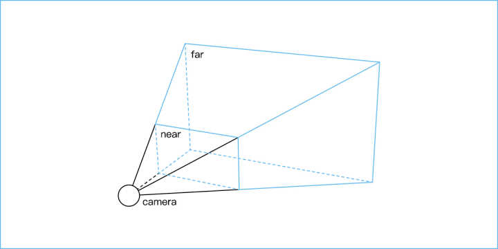
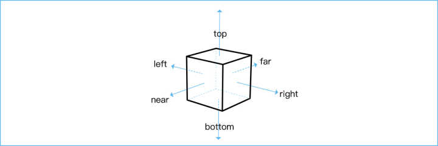
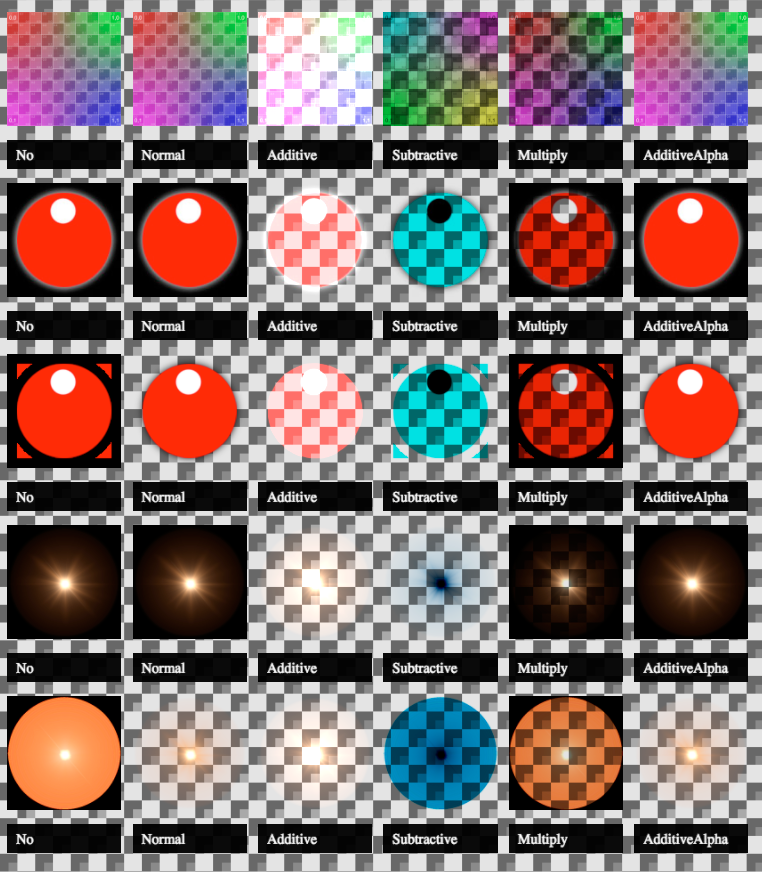
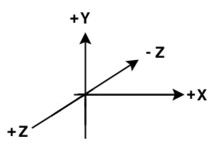
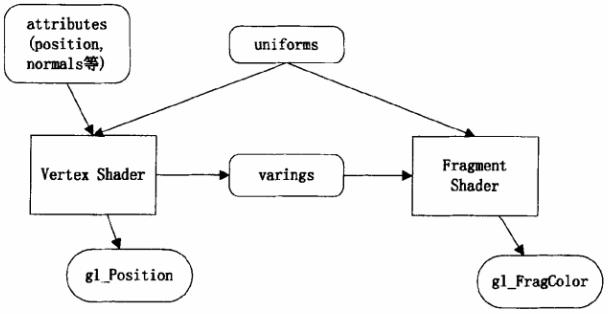

# THREE.js介绍

## Hello World

```js

	<!-- 创建渲染器 -->
	var renderer = new THREE.WebGLRenderer();
  renderer.setSize(window.innerWidth, window.innerHeight);
  document.body.appendChild(renderer.domElement);
	
	<!-- 创建场景 -->
  var scene = new THREE.Scene();
	
	<!-- 创建环境光 -->
  var directionalLight = new THREE.DirectionalLight(0xffffff);
  directionalLight.position.set(3, 1,3).normalize();
  scene.add(directionalLight);
  
  <!-- 创建照相机 -->
  var camera = new THREE.PerspectiveCamera(45, window.innerWidth / window.innerHeight, 1, 1000);
  camera.position.z = 700;
	
	<!-- 创建材质 -->
  var material = new THREE.MeshLambertMaterial({
      color:0xcccccc,
      wireframe:false
  });
  <!-- 创建球体 -->
  var earth = new THREE.Mesh(new THREE.SphereGeometry(100, 50, 50), material);
  scene.add(earth);
  
  <!-- 渲染场景 -->
  renderer.render(scene,camera);
```

## 常用的THREE.js对象

### camera 相机

> camera.position，camera.lookAt，camera.up的区别：

- camera.position
    
    > 相机世界坐标中的位置 （相机的位置）

- camera.lookAt

    > 相机看向某个世界坐标（镜头对准的方向）

- camera.up

    > 指定哪个位置是相机的上方，默认以Y轴为上方（镜头放正的方向）

- PerspectiveCamera

    > 透视相机
    
    

- OrthographicCamera

    > 正交投影相机

    

- CubeCamera

    > 创建六个PerspectiveCamera，并将这些相机渲染到WebGLRenderTargetCube渲染器中

- StereoCamera

    > 创建两个PerspectiveCamera，可用于图像立体显示，呈现视觉立体效果，当带上立体眼镜时，会产生相应的立体效果
	
### Geometries 几何体

- BufferGeometry
- BoxBufferGeometry
- BoxGeometry

  > 四边形几何

- CircleBufferGeometry
- CircleGeometry

    > 圆形或者扇形

- ConeBufferGeometry
- ConeGeometry

  > 锥形几何

- CylinderBufferGeometry
- CylinderGeometry

  > 柱体类

- DodecahedronBufferGeometry
- DodecahedronGeometry
- EdgesGeometry
- ExtrudeGeometry

  > 几何类, 用于从一条路径中抽取出特征用于构建几何形状

- ExtrudeBufferGeometry
- IcosahedronBufferGeometry
- IcosahedronGeometry
  
  > 正二十面体

- LatheBufferGeometry
- LatheGeometry
- OctahedronBufferGeometry
- OctahedronGeometry

  > 正八面体

- ParametricBufferGeometry
- ParametricGeometry
- PlaneBufferGeometry
- PlaneGeometry
  
  > 平面几何

- PolyhedronBufferGeometry
- PolyhedronGeometry
- RingBufferGeometry
- RingGeometry
- ShapeBufferGeometry
- ShapeGeometry
- SphereBufferGeometry
- SphereGeometry

  > 球体

- TetrahedronBufferGeometry
- TetrahedronGeometry

  >  正四面体

- TextBufferGeometry
- TextGeometry
- TorusBufferGeometry
- TorusGeometry

  > 圆环面, 也为甜甜圈的形状

- TorusKnotBufferGeometry
  
  > 圆环结, 形如打了结的甜甜圈

- TorusKnotGeometry
- TubeGeometry
- TubeBufferGeometry
- WireframeGeometry

### Materials 材质

- LineBasicMaterial
- LineDashedMaterial
- Material
- MeshBasicMaterial
  
  > 基础材质，仅仅是上了颜色的材质，也可以调整一些其他的参数，比如线框(wireframe)模式显示

- MeshDepthMaterial

  > 深度材质，这种材质会在靠近相机的部分明度较高

- MeshLambertMaterial

  > 朗伯材质，就是漫反射的材质，是以一位18世纪生于瑞士的德国数学家约翰·海因里希·朗伯(Johann Heinrich Lambert)命名的。它描述了物质吸收光的规律

  > 表现阴影效果的材质

- MeshNormalMaterial
  
  > 法向材质，不同角度的面会被按照某种规则上色

- MeshPhongMaterial

  > 是以一位越南出生的美籍法裔计算机图形学研究者裴祥風(Bùi Tường Phong)命名的，他发明了Phong反射模型和Phong着色法，这种材质有反光的表面和特定部位的高光，被CG界广为使用，类似金属反光效果
  
  > 表现阴影效果的材质

- MeshPhysicalMaterial
  
  > 物理材质是标准材质(MeshStandardMaterial)的扩展，在反射作用上，增加了更多可以调整的参数。为了更好地表现这种材质效果，一般会加入环境贴图

- MeshStandardMaterial
  
  > 标准的基于物理现实的材质。Physically based rendering (PBR)，目前PBR在众多3D应用中已成为统一标准，例如Unity、Unreal、3D Studio Max，这种材质会比MeshLambertMaterial和MeshPhongMaterial更精确更真实地渲染，但相应地，会消耗更多计算资源

- MeshToonMaterial
  
  > 是MeshPhongMaterial的扩展，在MeshPhongMaterial的基础上，使用卡通渲染(Toon shading)。这种渲染方式的特点是，使用大面积色块来替代色彩渐变，给人一种卡通画的感觉。使用这种材质的同时，给物体进行轮廓线描边会获得更好的效果

- PointsMaterial
- RawShaderMaterial
- ShaderMaterial
- ShadowMaterial
- SpriteMaterial

#### Material Constants 材质常量

Side

- THREE.FrontSide
- THREE.BackSide
- THREE.DoubleSide

Shading

- THREE.FlatShading
- THREE.SmoothShading

Colors

- THREE.NoColors
- THREE.FaceColors
- THREE.VertexColors

Blending Mode

- THREE.NoBlending
- THREE.NormalBlending
- THREE.AdditiveBlending
- THREE.SubtractiveBlending
- THREE.MultiplyBlending
- THREE.CustomBlending



Equations

- THREE.AddEquation
- THREE.SubtractEquation
- THREE.ReverseSubtractEquation
- THREE.MinEquation
- THREE.MaxEquation

Destination Factors

- THREE.ZeroFactor
- THREE.OneFactor
- THREE.SrcColorFactor
- THREE.OneMinusSrcColorFactor
- THREE.SrcAlphaFactor
- THREE.OneMinusSrcAlphaFactor
- THREE.DstAlphaFactor
- THREE.OneMinusDstAlphaFactor

Source Factors

- THREE.DstColorFactor
- THREE.OneMinusDstColorFactor
- THREE.SrcAlphaSaturateFactor

THREE.CustomBlending

> "ZeroFactor", "OneFactor", "SrcAlphaFactor", "OneMinusSrcAlphaFactor", "DstAlphaFactor", "OneMinusDstAlphaFactor", "DstColorFactor", "OneMinusDstColorFactor","SrcAlphaFactor"
示例：
```js
new THREE.MeshBasicMaterial({
    map:texture,
    transparent: true,
    side:THREE.BackSide,
    blending: THREE.CustomBlending,
    blendSrc: THREE.SrcAlphaFactor,
    blendDst: THREE.DstAlphaFactor,
    blendEquation: THREE.AddEquation
});
```

### Objects 物体

- Bone
- Group
- LensFlare
- Line
- LineLoop
- LineSegments
- LOD
- Mesh
- Points
- Skeleton
- SkinnedMesh
- Sprite

### Lights 光

- AmbientLight
  
  > 环境光

- DirectionalLight
  
  > 平行光，有阴影

- HemisphereLight
- Light
- PointLight

  > 点光源

- RectAreaLight
- SpotLight
  
  > 聚光灯，有阴影

### Math 数学相关的对象

- Box2
- Box3
- Color
- Cylindrical
- Euler
- Frustum
- Interpolant
- Line3
- Math
- Matrix3
- Matrix4
- Plane
- Quaternion
- Ray
- Sphere
- Spherical
- Triangle
- Vector2
- Vector3
- Vector4

### Loaders 加载器

- AnimationLoader
- AudioLoader
- BufferGeometryLoader
- Cache
- CompressedTextureLoader
- CubeTextureLoader
- DataTextureLoader
- FileLoader
- FontLoader
- ImageLoader
- JSONLoader
- Loader
- MaterialLoader
- ObjectLoader
- TextureLoader

### Helpers 助手

- ArrowHelper
- AxesHelper
- BoxHelper
- Box3Helper
- CameraHelper
- DirectionalLightHelper
- FaceNormalsHelper
- GridHelper
- PolarGridHelper
- HemisphereLightHelper
- PlaneHelper
- PointLightHelper
- RectAreaLightHelper
- SkeletonHelper
- SpotLightHelper
- VertexNormalsHelper


## 概念术语

- Coordinate System 坐标系
    - 裁剪空间
    - 世界坐标系，物理坐标系，视图坐标系
    - 左、右手坐标系

        > 右手坐标系：即以右手握住Z轴,让右手的四指从X轴的正向以90度的直角转向Y轴的正向,这时大拇指所指的方向就是Z轴的正向.这样的三个坐标轴构成的坐标系称为右手空间直角坐标系。

        > 将右手背对着屏幕放置，拇指即指向X轴的正方向。伸出食指和中指，食指指向Y轴的正方向，中指所指示的方向即是Z轴的正方向

    左手坐标系
    右手坐标系

    - 球坐标

    > 球坐标系是一种利用球坐标(r,θ,φ)来表示一个点 P 在三维空间的位置的三维正交坐标系。

    > 下图描述了球坐标的几何意义：原点O与目标点P之间的径向距离为r，O到P的连线与正z-轴之间的夹角为天顶角θ，O到P的连线在xy-平面上的投影线与正x-轴之间的夹角为方位角φ。

    

    > 笛卡尔坐标 转 球坐标
    
    $$
      \begin{align}\label{eq:1}
      & r = \sqrt{x^2 + y^2 + z^2}
      \\
      & θ = \arctan\left(\frac{\sqrt{x^2 + y^2}}{z}\right) = \arccos\left(\frac{z}{\sqrt{x^2 + y^2 + z^2}}\right)
      \\
      & φ = \arctan\left(\frac{y}{x}\right)
      \end{align}
    $$


    > 球坐标 转 笛卡尔坐标

    $$
      \begin{align}\label{eq:2}
      & x = r*\sin(θ)*\cos(φ)
      \\
      & y = r*\sin(θ)*\sin(φ)
      \\
      & z = r*\cos(θ)
      \end{align}
    $$

    - 齐次坐标

        > 三维顶点为三元组(x,y,z),引入一个新的分量w，得到向量(x,y,z,w): 若w=1，则向量(x, y, z, 1)为空间中的点;若w=0，则向量(x, y, z, 0)为方向

        > 三维图形学中我们只用到4x4矩阵，它能对顶点(x,y,z,w)作变换。这一变换是用矩阵左乘顶点来实现的：矩阵 * 顶点 = 变换后的顶点;
        
        > 累积变换的顺序: 先缩放,接着旋转,最后平移：TransformedVector = TranslationMatrix * RotationMatrix * ScaleMatrix * OriginalVector;

    - 笛卡尔坐标


- GLSL



- 虚数，四元数
- Euler angles 欧拉角
- Quaternions 四元数
- Vector 向量
- 法向量
- Matrix 矩阵
  - 模型-视图矩阵（ModelView matrix）
  - 投影矩阵（projection matrix）

- Matrix transformations 矩阵变换

    
    

## 推荐书籍

- Three.js开发指南 （Learning Three.js）
- 3D数学基础：图形与游戏开发
- 3D游戏编程大师技巧(上，下)
- 代码本色  用编程模拟自然系统 （The Nature of Code）
- 
